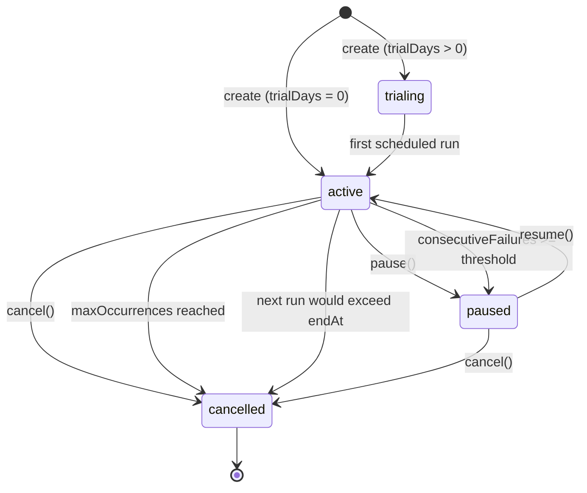

# Recurring Payments

## Overview

Recurring payment plans let a merchant charge a payer on a fixed interval (daily, weekly or
monthly) without driving each charge manually. A plan stores the amount, currency, interval and
billing limits; a background scheduler picks up every due plan and creates a **normal payment**
through the existing `PaymentsService`, so fees, splits, webhooks and receipts behave exactly like
a one-off payment.

This document covers the plan model, the full lifecycle, the seven lifecycle endpoints, the
automatic scheduling/failure behaviour, and the webhooks and emails a plan emits.

> Source of truth: `src/modules/payments/recurring-payments.controller.ts`,
> `src/modules/payments/recurring-payments.service.ts` and
> `src/modules/payments/recurring-payment.entity.ts`.

## Authentication

Every endpoint is guarded by `JwtAuthGuard` and scoped to the authenticated merchant
(`createdBy`). Requests need a bearer token:

```bash
-H "Authorization: Bearer <jwt>"
```

The base path is `/v1/recurring-payments`.

## Plan fields

| Field | Type | Required | Default | Notes |
| --- | --- | --- | --- | --- |
| `amount` | number | yes | — | Positive, minimum `0.01`. Copied to each generated payment. |
| `currency` | string | yes | — | ISO 4217; must be a currency supported by this API instance. |
| `interval` | enum | yes | — | `daily`, `weekly` or `monthly`. |
| `trialDays` | integer | no | `0` | `0–365`. Number of free days before the first charge. |
| `description` | string | no | `null` | Max 500 characters; applied to every generated payment. |
| `merchantId` | string | no | `null` | Merchant the plan belongs to (used for routing webhooks). |
| `merchantEmail` | string | no | `null` | Receives per-payment notifications. |
| `payerEmail` | string | no | `null` | Receives the pre-charge reminder email. |
| `customerId` | UUID | no | `null` | Customer owned by the merchant; copied to each generated payment. |
| `callbackUrl` | URL | no | `null` | Webhook callback URL applied to each generated payment. |
| `metadata` | object | no | `null` | Arbitrary string key/value pairs copied to each generated payment. |
| `startAt` | ISO-8601 | no | now | When the first charge (or trial) should start. |
| `endAt` | ISO-8601 | no | `null` | Must be in the future. Plan auto-cancels once the next run would exceed it. |
| `maxOccurrences` | number | no | `null` | `≥ 1`. Successful charges before the plan auto-cancels. |
| `notifyDaysBefore` | integer | no | `3` | `0–14`. Days before a charge to email the payer. `0` disables reminders. |

`interval` copies forward: `PATCH` changes apply to **future** scheduled runs only — payments that
already exist are never modified.

## Status lifecycle

`RecurringPaymentStatus` has four values:

- `active` — the scheduler will charge it when `nextRunAt` is due.
- `trialing` — still inside the free-trial window; the scheduler flips it to `active` on the first
  successful run.
- `paused` — suspended, either manually or automatically after repeated failures. No charges run.
- `cancelled` — terminal. Set by a manual cancel **or** by the plan completing its
  `maxOccurrences` / reaching `endAt`.

There is no separate `completed` status: a plan that finishes its schedule is stored as
`cancelled` with `cancelledAt` set, exactly like a manually cancelled plan.



Lifecycle rules enforced by the service:

- `pause` requires status `active`; anything else returns `409 Conflict`.
- `resume` requires status `paused`; anything else returns `409 Conflict`. If `nextRunAt` is in the
  past, resuming sets it to "now" so the plan does not immediately back-fill missed cycles.
- `cancel` returns `409 Conflict` if the plan is already `cancelled`.
- A plan that is not owned by the caller returns `404 Not Found` for every operation.

## Endpoints

### 1. Create a plan

```
POST /v1/recurring-payments
```

```bash
curl -X POST http://localhost:3000/v1/recurring-payments \
  -H "Authorization: Bearer $TOKEN" \
  -H "Content-Type: application/json" \
  -d '{
    "amount": 29.99,
    "currency": "USD",
    "interval": "monthly",
    "description": "Monthly subscription",
    "merchantId": "merch_123",
    "merchantEmail": "merchant@example.com",
    "payerEmail": "payer@example.com",
    "customerId": "550e8400-e29b-41d4-a716-446655440000",
    "callbackUrl": "https://merchant.example.com/webhooks/payment",
    "metadata": { "orderId": "sub_123" },
    "trialDays": 14,
    "maxOccurrences": 12,
    "endAt": "2027-08-01T00:00:00Z",
    "notifyDaysBefore": 3
  }'
```

Response (`201 Created`):

```json
{
  "id": "9f1c2b3a-4d5e-6f70-8192-a3b4c5d6e7f8",
  "amount": "29.99",
  "currency": "USD",
  "interval": "monthly",
  "status": "trialing",
  "description": "Monthly subscription",
  "merchantId": "merch_123",
  "customerId": "550e8400-e29b-41d4-a716-446655440000",
  "merchantEmail": "merchant@example.com",
  "payerEmail": "payer@example.com",
  "callbackUrl": "https://merchant.example.com/webhooks/payment",
  "metadata": { "orderId": "sub_123" },
  "trialDays": 14,
  "trialEndsAt": "2026-10-12T00:00:00.000Z",
  "nextRunAt": "2026-10-12T00:00:00.000Z",
  "occurrences": 0,
  "consecutiveFailures": 0,
  "notifyDaysBefore": 3,
  "endAt": "2027-08-01T00:00:00.000Z",
  "maxOccurrences": 12,
  "cancelledAt": null,
  "createdAt": "2026-09-28T10:00:00.000Z",
  "updatedAt": "2026-09-28T10:00:00.000Z"
}
```

When `trialDays > 0` and `startAt` is supplied, `trialEndsAt` and `nextRunAt` are both
`startAt + trialDays`; otherwise they are `startAt` (or now) plus `trialDays`. `endAt` in the past
returns `400 Bad Request`.

### 2. List plans

```
GET /v1/recurring-payments
```

Returns every plan owned by the caller, newest first.

```bash
curl http://localhost:3000/v1/recurring-payments -H "Authorization: Bearer $TOKEN"
```

```json
[
  {
    "id": "9f1c2b3a-4d5e-6f70-8192-a3b4c5d6e7f8",
    "amount": "29.99",
    "currency": "USD",
    "interval": "monthly",
    "status": "active",
    "nextRunAt": "2026-11-12T00:00:00.000Z",
    "occurrences": 1
  }
]
```

### 3. Get a plan

```
GET /v1/recurring-payments/:id
```

```bash
curl http://localhost:3000/v1/recurring-payments/9f1c2b3a-4d5e-6f70-8192-a3b4c5d6e7f8 \
  -H "Authorization: Bearer $TOKEN"
```

Returns the full plan object shown in the create response, or `404 Not Found`.

### 4. List charge attempts

```
GET /v1/recurring-payments/:id/charges?page=1&limit=20
```

Returns charge attempts in chronological order (`attemptedAt` ascending), including failed
attempts and their failure reason.

```bash
curl "http://localhost:3000/v1/recurring-payments/9f1c2b3a-4d5e-6f70-8192-a3b4c5d6e7f8/charges?page=1&limit=20" \
  -H "Authorization: Bearer $TOKEN"
```

```json
{
  "data": [
    {
      "id": "1a2b3c4d-5e6f-7081-92a3-b4c5d6e7f809",
      "recurringPaymentId": "9f1c2b3a-4d5e-6f70-8192-a3b4c5d6e7f8",
      "cycleNumber": 1,
      "paymentId": "aa11bb22-cc33-dd44-ee55-ff6677889900",
      "amount": "29.99",
      "status": "succeeded",
      "failureReason": null,
      "attemptedAt": "2026-11-12T00:00:00.000Z"
    }
  ],
  "total": 1,
  "page": 1,
  "limit": 20
}
```

Charge statuses are `pending`, `succeeded` and `failed`.

### 5. Update a plan

```
PATCH /v1/recurring-payments/:id
```

Only `amount`, `interval` and `description` are mutable. Changes take effect on the **next**
scheduled run; existing payments are untouched.

```bash
curl -X PATCH http://localhost:3000/v1/recurring-payments/9f1c2b3a-4d5e-6f70-8192-a3b4c5d6e7f8 \
  -H "Authorization: Bearer $TOKEN" \
  -H "Content-Type: application/json" \
  -d '{"amount": 39.99, "interval": "weekly", "description": "Pro plan"}'
```

### 6. Pause a plan

```
POST /v1/recurring-payments/:id/pause
```

```bash
curl -X POST http://localhost:3000/v1/recurring-payments/9f1c2b3a-4d5e-6f70-8192-a3b4c5d6e7f8/pause \
  -H "Authorization: Bearer $TOKEN"
```

Sets `status` to `paused`. Returns `409 Conflict` if the plan is not `active`.

### 7. Resume a plan

```
POST /v1/recurring-payments/:id/resume
```

```bash
curl -X POST http://localhost:3000/v1/recurring-payments/9f1c2b3a-4d5e-6f70-8192-a3b4c5d6e7f8/resume \
  -H "Authorization: Bearer $TOKEN"
```

Sets `status` back to `active`; a `nextRunAt` in the past is reset to the current time. Returns
`409 Conflict` if the plan is not `paused`.

### 8. Cancel a plan

```
POST /v1/recurring-payments/:id/cancel
```

```bash
curl -X POST http://localhost:3000/v1/recurring-payments/9f1c2b3a-4d5e-6f70-8192-a3b4c5d6e7f8/cancel \
  -H "Authorization: Bearer $TOKEN"
```

Sets `status` to `cancelled` and stamps `cancelledAt`. Returns `409 Conflict` when the plan is
already cancelled. Cancelling is terminal — a cancelled plan cannot be resumed.

## Scheduling and execution

- A cron job (`processDuePlans`, `@Cron(EVERY_MINUTE)`) loads all `active` and `trialing` plans
  whose `nextRunAt` is due and runs them one by one.
- For each run the service writes a `RecurringPaymentCharge` row (`pending`), creates a payment
  through the existing `PaymentsService` flow, then marks the charge `succeeded` and links
  `paymentId`.
- Each run is guarded by an idempotency key of the form
  `recurring-payment:<planId>:<scheduledFor ISO>` so an overlapping or retried sweep cannot
  double-charge.
- After a successful charge the service increments `occurrences`, sets `lastRunAt` to the
  scheduled time, resets `consecutiveFailures` to `0`, and advances `nextRunAt` by one interval
  (`+1 day`, `+7 days`, or `+1 month`).

### Intervals

| Interval | Advance applied to `nextRunAt` |
| --- | --- |
| `daily` | +1 day |
| `weekly` | +7 days |
| `monthly` | +1 month |

## Trial handling

- Creating a plan with `trialDays > 0` sets `status: trialing` and `nextRunAt = trialEndsAt`.
- On the first successful run the plan is switched to `active` and the normal charge proceeds.
- A second cron job (`notifyTrialEnding`, every minute) looks for `trialing` plans whose trial ends
  within the next 3 days and dispatches the `recurring.trial_ending` merchant webhook once per
  plan, recording `trialEndingNotifiedAt`.

## End date and max occurrences

Limits are checked **after** a successful charge:

- If `maxOccurrences` is set and `occurrences >= maxOccurrences`, the plan is set to `cancelled`
  with `cancelledAt`, and `nextRunAt` is advanced one last time for the record.
- If `endAt` is set and the next run would fall after it, the plan is set to `cancelled` with
  `cancelledAt`.

In both cases the charge that hit the limit is kept — limits stop *future* charges only.

## Failure handling

When a run throws, the service:

1. Marks the pending `RecurringPaymentCharge` as `failed` and records `failureReason` (truncated to
   4000 characters).
2. Increments `consecutiveFailures` on the plan.
3. If `consecutiveFailures >= RECURRING_PAYMENT_AUTO_PAUSE_FAILURES` (default `3`), sets the plan
   to `paused`, logs a warning and notifies the merchant (`notifyPlanPaused`).

A successful charge resets `consecutiveFailures` to `0`. A manually resumed plan therefore needs
another full run of failures before it auto-pauses again.

## Notifications

### Webhooks

- Each generated charge goes through the normal payment pipeline, so it emits the standard payment
  events to the merchant's registered endpoints — `payment.created` when the payment is created,
  plus the usual `payment.completed` / `payment.failed` / `payment.split_processed` events as the
  payment progresses.
- `recurring.trial_ending` is dispatched directly to the merchant when a trial is within 3 days of
  ending. Payload:

  ```json
  {
    "planId": "9f1c2b3a-4d5e-6f70-8192-a3b4c5d6e7f8",
    "trialEndsAt": "2026-10-12T00:00:00.000Z"
  }
  ```

  See [`docs/WEBHOOKS.md`](./WEBHOOKS.md) for signature verification and the retry pipeline.

### Emails

- **Pre-charge payer reminder** — a daily cron job (`notifyUpcomingCharges`,
  `@Cron(EVERY_DAY_AT_8AM)`) finds `active` plans with `notifyDaysBefore >= 1` whose next charge is
  within the notification window (`0 <= daysUntilCharge <= notifyDaysBefore`) and sends the
  `payer-recurring-payment-reminder` template to `payerEmail`. It fires at most once per cycle,
  tracked by `lastNotifiedCycle` (cycle number = `occurrences + 1`). Reminders require both
  `payerEmail` and `merchantEmail` to be set and `notifyDaysBefore != 0`.
- **Payment emails** — each generated payment uses the standard payment notification flow, so the
  regular payment emails (including the merchant/payer copies and receipts) are sent as for a
  one-off payment.

## Charge history

Every attempt is persisted in `recurring_payment_charges` with `cycleNumber`, `paymentId`, `amount`,
`status`, `failureReason` and `attemptedAt`, and is exposed by
`GET /v1/recurring-payments/:id/charges`.

## Relevant files

- `src/modules/payments/recurring-payments.controller.ts` — HTTP surface.
- `src/modules/payments/recurring-payments.service.ts` — lifecycle, scheduler, failure handling.
- `src/modules/payments/recurring-payment.entity.ts` — plan model and enums.
- `src/modules/payments/recurring-payment-charge.entity.ts` — per-attempt model.
- `src/modules/payments/dto/create-recurring-payment.dto.ts` — create payload validation.
- `src/modules/payments/dto/update-recurring-payment.dto.ts` — update payload validation.
- `src/modules/notifications/templates/*/payer-recurring-payment-reminder.hbs` — reminder emails.
